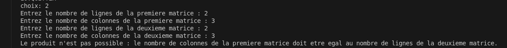
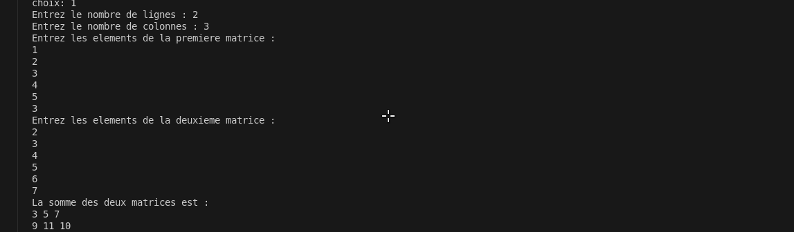
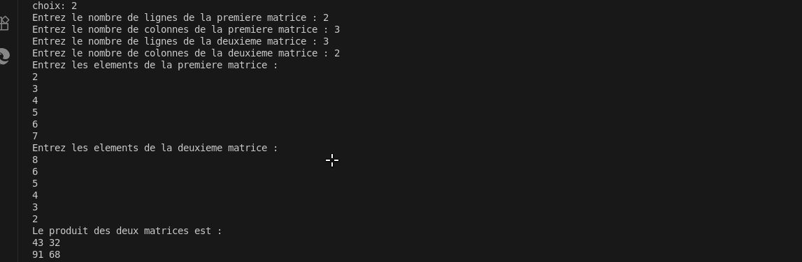
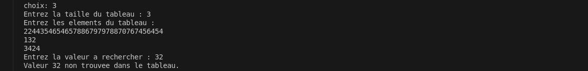
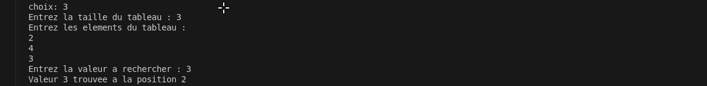
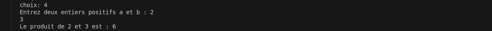
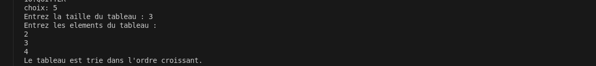
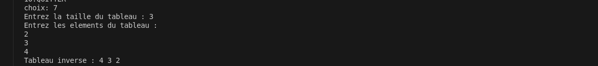
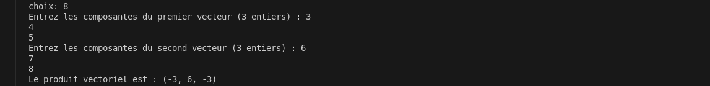
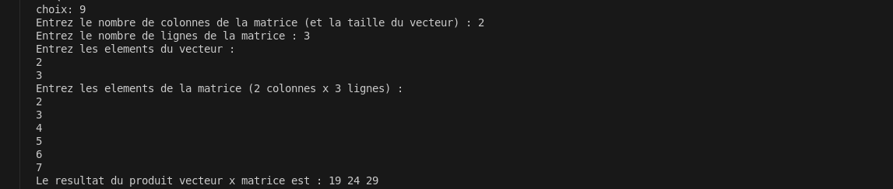

# TP 231 : Opérations sur les tableaux et matrices en C

## Description du projet
Ce projet regroupe plusieurs fonctions classiques de manipulation de tableaux et de matrices en langage C :
- Somme de matrices
- Produit de matrices
- Recherche séquentielle dans un tableau
- a+b pour a,b>0 en utilisant exclivement +1
- Test si un tableau est trié
- Calcul du médian dans un tableau
- Inversion d’un tableau
- Produit vectoriel
- Produit vecteur × matrice

## Instructions de compilation et d’exécution

```bash
gcc *.c -o main
./main
```

## Exemples de résultats (captures d’écran)
### main.c
dans se main.c nous avons fait un acceuil pour le visiteur afin qu'il puis effectuer des operationde son choix
voici l'image de cet page d'acceuil

### Somme de matrices
dans cet fonction nous avons mie des une Nb: le nombre de colonne de la 1er matrice doit etre le meme nombre de ligne de la matrice 2
voir image en cas de non respect de cet NB 


en cas de validation du NB


### Produit de matrices
voir le resultat apres operation


### Recherche séquentielle
voir en cas de non trouver

en cas de nombre trouver


### a*b pour a,b>0 en utilisant uniquement +1
voir resultat


### tester si un tableau est trie
voir resltat


### le median dans un tableau
voir resulta


### inverser un tableau
voir resultat


### produit vectouiel
voir tableau


### produit vecteur*mactrice
voir resulta


### fermeture
voir image


## Liste des participants (nom et matricule)
-YANKOUA MBAKOP YVES STEPHANE   24G2413
- NDAOBA MOHAMAT 24G2687
- Nom Prénom 3
## Structure du projet
- Un fichier source par fonctionnalité
- Un main.c pour le menu et l’appel des fonctions
- Un README.md pour la documentation

